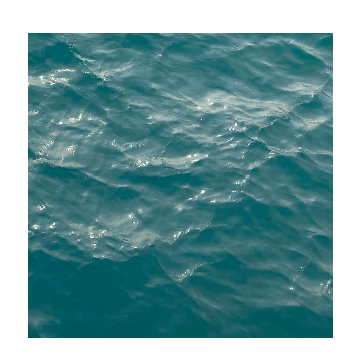

# KJY's Blog

记录具有价值，不要为过去的自己而感到羞耻

道阻且长，行则将至；行而不辍，未来可期

这个网站是自己的一个长期主义的试验田

永远追求先进

<!-- Bioinformatics Scholar. Data Scientist. -->

<!-- ISTJer and minimalist. -->

Documents have value, don't be ashamed of yourself.

Long and difficult as the journey may be, sustained actions will take us to the destination.

This site is a praxis for my long-termism



<!-- 一些空格 -->

 

 

 

 

 

<!-- 没想好说什么这边 -->

可以通过utteranc给我留言。

Leave me a message by utteranc.

试试这里/Try here

KJY means Kongjian Yang

Just start coding for interest

