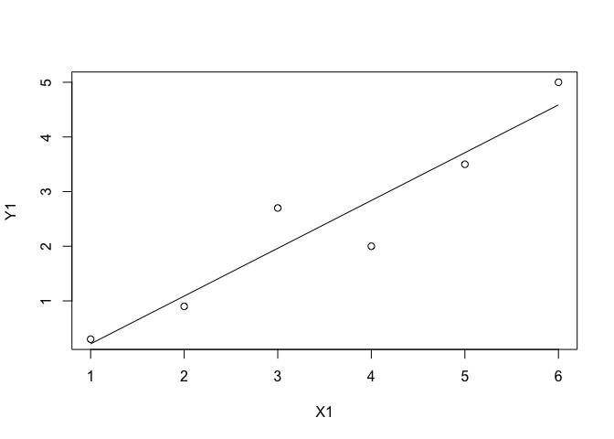
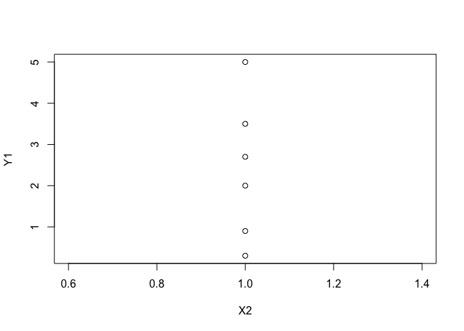

三个相关性系数（pearson, spearman,
kendall）反应的都是两个变量之间变化趋势的方向以及程度，其值范围为-1到+1，0表示两个变量不相关，正值表示正相关，负值表示负相关，值越大表示相关性越强。

<!--more-->

## 1. 皮尔森相关性系数

两个变量(X,
Y)的皮尔森相关性系数(ρX,Y)等于它们之间的协方差cov(X,Y)除以它们各自标准差的乘积(σX,
σY)。

公式的分母是变量的标准差，这就意味着计算皮尔森相关性系数时，变量的标准差不能为0（分母不能为0），也就是说你的两个变量中任何一个的值不能都是相同的。如果没有变化，用皮尔森相关系数是没办法算出这个变量与另一个变量之间是不是有相关性的。

假设我们现在的实验有两个变量：

X1=c(1, 2, 3, 4, 5, 6)

Y1=c(0.3, 0.9, 2.7, 2, 3.5, 5)

用R计算相关性系数

    X1<-c(1, 2, 3, 4, 5, 6) 
    Y1<-c(0.3, 0.9, 2.7, 2, 3.5, 5) 
    cor(X1, Y1, method = "pearson") #皮尔森相关性系数
    
    ## [1] 0.9481367
    
    z <- lm(Y1 ~ X1)
    plot(x=X1, y= Y1)
    lines(X1, fitted(z))

其值在0.9以上，说明二者非常相关，比如验证了蛋白A表达量的变化，与蛋白B表达量的变化关系很大！拿到这种有统计学论证的结果你可能很开心。作图可知相关性系数确实很高。

然而，由于实验操作不慎或者处理数据不小心，得到了这样一个变量X2(1,1,1,1,1,1)，那么计算X2与Y1之间的皮尔森相关性系数会发生什么呢？

    X2<-c(1,1,1,1,1,1) 
    cor(X2, Y1, method = "pearson") 
    
    ## Warning in cor(X2, Y1, method = "pearson"): the standard deviation is zero
    
    ## [1] NA
    
    plot(x = X2, y = Y1)

R运行会得到一个缺失值（NA），并且代码给你提醒：标准差为零，也就是说，X2里面的取值根本没有任何波动，那它与Y1的相关性也就没法用这种方法来计算了。

此外，从上面的公式我们知道，皮尔森相关性系数是协方差与标准差的比值，所以它对数据是有比较高的要求的：

第一，
实验数据通常假设是成对的来自于正态分布的总体。为啥通常会假设为正态分布呢？因为我们在求皮尔森相关性系数以后，通常还会用t检验之类的方法来进行皮尔森相关性系数检验，而
t检验是基于数据呈正态分布的假设的。

第二，
实验数据之间的差距不能太大，或者说皮尔森相关性系数受异常值的影响比较大。比如刚才心跳与跑步的例子，万一这个人的心脏不太好，跑到一定速度后承受不了，突发心脏病，那这时候我们会测到一个偏离正常值的心跳（过快或者过慢，甚至为0），如果我们把这个值也放进去进行相关性分析，它的存在会大大干扰计算的结果的。

## 2. 斯皮尔曼相关性系数

斯皮尔曼相关性系数，通常也叫斯皮尔曼秩相关系数。“秩”，可以理解成就是一种顺序或者排序，那么它就是根据原始数据的排序位置进行求解，这种表征形式就没有了求皮尔森相关性系数时那些限制。

斯皮尔曼相关性系数，通常也叫斯皮尔曼秩相关系数。“秩”，可以理解成就是一种顺序或者排序，那么它就是根据原始数据的排序位置进行求解，这种表征形式就没有了求皮尔森相关性系数时那些限制。

计算过程就是：首先对两个变量（X,
Y）的数据进行排序，然后记下排序以后的位置（X’, Y’），（X’,
Y’）的值就称为秩次，秩次的差值就是上面公式中的di，n就是变量中数据的个数，最后带入公式就可求解结果。举个例子吧，假设我们实验的数据如下：

    data
    
    ##   原始位置 原始X 排序后 秩次X. 原始Y 排序后.1 秩次Y. 秩次差的平方
    ## 1        1    11    490      5     2       75      6            1
    ## 2        2   490     43      1    75       44      1            0
    ## 3        3    14     30      4     3       42      5            1
    ## 4        4    43     14      2    44        7      2            0
    ## 5        5    30     11      3     7        3      4            1
    ## 6        6     3      3      6    42        2      3            9

带入公式，求得斯皮尔曼相关性系数：ρs= 1-6*(1+1+1+9)/6*35=0.657

也就是说，我们不用管X和Y这两个变量具体的值到底差了多少，只需要算一下它们每个值所处的排列位置的差值，就可以求出相关性系数了。这下理解起来是不是容易多了！还是用上面的数据，下面写下代码实现：

    X<-c(11,490,14,43,30,3) 
    Y<-c(2,75,3,44,7,42) 
    cor(X,Y,method="spearman") 
    
    ## [1] 0.6571429

而且，即便在变量值没有变化的情况下，也不会出现像皮尔森系数那样分母为0而无法计算的情况。另外，即使出现异常值，由于异常值的秩次通常不会有明显的变化（比如过大或者过小，那要么排第一，要么排最后），所以对斯皮尔曼相关性系数的影响也非常小！

由于斯皮尔曼相关性系数没有那些数据条件要求，适用的范围就广多了。在我们生物实验数据分析中，尤其是在分析多组学交叉的数据中说明不同组学数据之间的相关性时，使用的频率很高。
